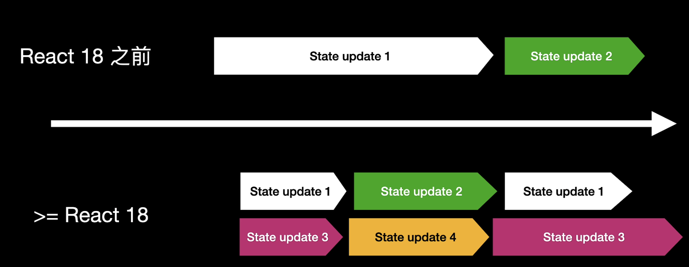

## React 18

1. New Features
2. New Hooks
3. How to upgrade to React 18?
4. others ?

## New Features

- Automatic batching
    - Fewer re-renders for better performance
    
    - works outside of event handlers
    
        | < React 18          | > = React 18         |
        | ------------------- | -------------------- |
        | React event Handler | React event handler  |
        |                     | Promise              |
        |                     | SetTimeout           |
        |                     | native event handler |
        |                     | …                    |
    
    - safe, but you can opt out when needed.
        - ### flushAsync
    
          ```jsx
          import {flushSync} from 'react-dom'
          
          function handleClick () {
            flushSync(() => setCounter(c => c+1))
          }
          ```
    
          

- Concurrent Rendering

  

  - one show doesn’t slow down the whole page
  - slow initial HTML early and stream the rest (SSR)
  - code splitting fully integrated with servering rendering

  > 并发渲染：
  >
  > - 渲染可以被中断、继续、中止
  > - 渲染可以在后台进行
  > - 渲染可以有优先级，可以将某些更新标记为`可中断的` 和`非紧急的` 也就是所谓的`transitions。`这种新特性在大量的UI更新操作中尤其有效，以此来保证大型渲染中UI不会被卡住，给用户带来更流程的用户体验
  > - 不是新功能，而是一种全新新的底层机制，是后来许多功能的基础，比如`Suspense`, `transition`等

- Suspense
    - loading
    - code spliting
    - Suspense support for SSR

    > 原理：
    >
    > catch promise status，找到离它最近的Suspense组件

## New Hooks

- useId
- Transition
    - startTransition - for Class-Based Components
    - useTransition - for hooks

- useDeferredValue
- Library Hooks
    - useSyncExternalStore
    - useInsertionEffect

## How to upgrade to React 18?

- createRoot
  
    ```jsx
    // before
    import ReactDOM from 'react-dom';
    import App from './App';
    ReactDOM.render(<App />, document.getElementById('app'));
    
    // After
    import ReactDOM from 'react-dom/client';
    import App from './App';
    const root = ReactDOM.createRoot(document.getElementById('app'));
    root.render(<App />);
    ```
    

