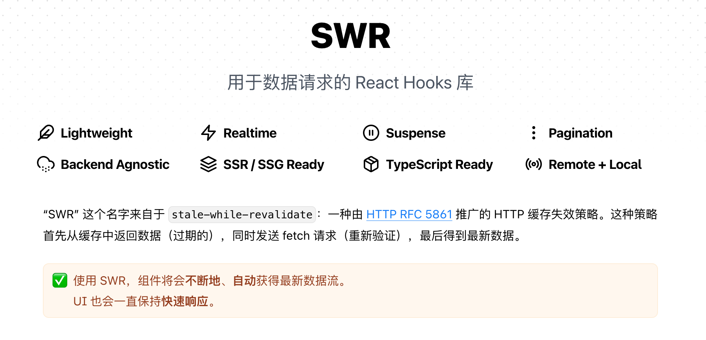

# SWR

分享路径：begin=>基本应用引入-->具体场景举例-->工程使用时注意事项=>end.


## What?


### 使用方式

1. 全局配置  https://swr.bootcss.com/docs/data-fetching

```js
// 自定义 fetcher
const customFetcher = (...args) => fetch(...args).then((res) => res.json())

// 使用中间件修改 key，防止每次都传入全局通用参数
const createPatchKeyMiddleware = (type, id) =>
  (swrNext) => (key, fetcher, config) => {
    if (typeof key === string) {
      return swrNext(key, fetcher, config)
    }
    return swrNext([type, id, ...key], fetcher, config)
  }

const App = ({parentType, parentId}) => {
  const patchKeyMiddleware = createPatchKeyMiddleware(parentType, parentId)
  return (
    <SWRConfig value={{fetcher: customFetcher, use: [patchKeyMiddleware]}}>
      {...}
    </SWRConfig>
  )
}
```

2. API基本应用  https://swr.bootcss.com/docs/api

   

   ```js
   import useSWR from "swr";
   
   function Profile() {
     const { data, error, isLoading } = useSWR("/api/user/123", fetcher)
   
     if (error) return <div>failed to load</div>
     if (isLoading) return <div>loading...</div>
   
     // 渲染数据
     return <div>hello {data.name}!</div>
   }
   ```

   

3. 提取可复用hook

   ```js
   function useUser(id) {
     const { data, error, isLoading } = useSWR(`/api/user/${id}`, fetcher)
   
     return {
       user: data,
       isLoading,
       isError: error,
     }
   }
   
   function Avatar({ id }) {
     const { user, isLoading, isError } = useUser(id)
   
     if (isLoading) return <Spinner />
     if (isError) return <Error />
     return 
   }
   ```

   

## When?

1. data error loading

   ```js
   import useSWR from 'swr'
    
   const fetcher = (...args) => fetch(...args).then((res) => res.json())
    
   function Profile() {
     const { data, error } = useSWR('/api/profile-data', fetcher)
    
     if (error) return <div>Failed to load</div>
     if (!data) return <div>Loading...</div>
    
     return (
       <div>
         <h1>{data.name}</h1>
         <p>{data.bio}</p>
       </div>
     )
   }
   ```

   

2. 页面导航 ：先命中cache数据，后请求

3. 间隔轮询：logger

4. 数据依赖: Demo1

5. 聚焦时重新验证  https://codesandbox.io/s/swr-auth-vl653w?from-embed

6. 网络恢复时重新验证

7. 智能错误重试 Refetching: demo

8. 分页/滚动位置恢复 https://swr.bootcss.com/examples/infinite-loading

9. 乐观更新(Optimistic UI)-本地缓存更新

10. 请求时序问题

11. 数据预加载

12. 静态数据
  - 使用 useSWRImmutable 来保证返回的 data 永远不会重新请求
  - 传入空值 key 来禁止请求
1.  Suspense


## Others
缺点：
工程化应用中需要注意的地方？
- key的唯一性

- 全局性数据

- 不能中断请求

- error onError

  ```js
  <SWRConfig value={{
    onError: (error, key) => {
      if (error.status !== 403 && error.status !== 404) {
        // 我们可以把错误发送给 Sentry，
        // 或显示一个通知 UI。
      }
    }
  }}>
    <App />
  </SWRConfig>
  ```

  

- cache
  - cache的清除
  - 复杂数据结构

**其他的一些类似的库**

- react-query(对每个features提供了定制能力，例如：针对针对「浏览器窗口 focus 后重新请求这一点」，swr 和 useRequest 都只是提供开关，react-query可以定制)

- useRequest（ahooks-useRequest）

- swr

  