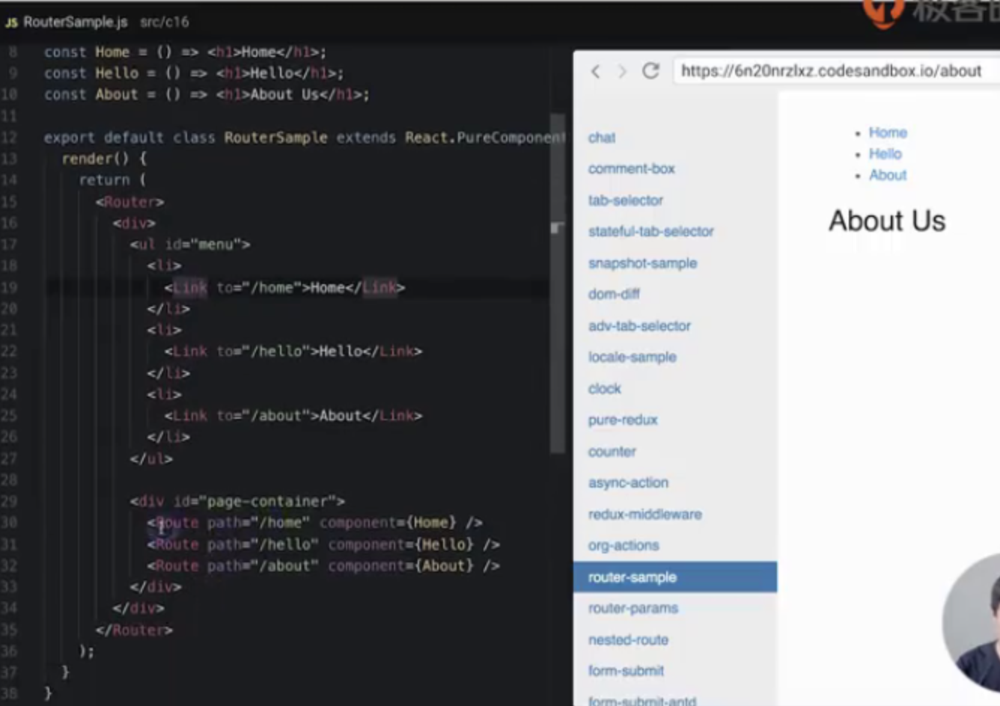

# React-Router

react-router是react生态圈中非常重要的一个部分，用来实现前端路由。react-router虽然不是facebook官方出品的，但是已经是react应用中实现路由的一个标准。

什么是路由呢？事实上就是当我们在页面上进行URL切换的时候，需要在页面上显示不同的内容。传统意义上来说，路由是一个后端的概念。当发送URL请求到服务器端时候，服务端会根据不同的URL来返回不同页面。随着前端应用越来越复杂，单页面应用的出现，前端也需要用路由来隔离不同的业务功能。

## 为什么需要路由

1. 单页应用需要进行页面切换

2. 通过URL可以定位到页面

   这样的话，虽然是单页面应用，切换页面不需要浏览器刷新，但是URL的地址仍然会定位到当前访问的页面，当强制刷新浏览器或者将URL分享给其他人的时候，仍然可以访问到对应的页面。

3. `更有语义的组织资源`

   路由不仅仅是页面的切换，还可以更有语义的去组织你的资源。因为每个页面的功能其实是高内聚松耦合的，可以通过URL将它们很好的隔离。不仅是业务功能，包括做lazy load或者其他的资源组织，路由都可以很好的帮助你。

[示例]()

## 路由架构

路由在前端实现的基本原理是什么样的呢？

1. 路由定义

   配置文件或直接通过react标记，定义路由到组件的映射，

2. Router

   解析，根据URL不同地址，返回不同组件

3. 组件容器

   路由如何render到页面呢？通过定义组件容器。组件容器通常是页面布局的一部分，这部分是由react-router来控制具体展示什么。当URL变化时，组件容器内容发生变化。

[代码]()

## React-Router特性

1. 声明式路由定义

   路由的使用，像使用react标记一样，可以作为一个Tag使用，使用的时候非常灵活，可以用在页面的任何地方使用一个路由，在任何地方都可以根据URL的地址来显示或者隐藏某个组件，不需要一个特殊的路由表去声明。

2. 动态路由

   在页面render时候才会被实时解析的。

## 三种路由实现方式

1. URL路径

2. hash路由

   1. #
   2. 对于有的低版本浏览器，不支持路由改变但不刷新，就需要用hash路由

3. 内存路由

   MemoryRouter，常用于，服务端渲染时候，路由不体现在url中，在内存中

## 基于路由配置进行资源组织

路由不仅仅是页面的切换，而且能帮助你进行更合理的资源的组织。

1. 实现业务逻辑的松耦合

   把页面相关的部分组织在一起，无论是业务、代码或者一些lazy load，都可以基于路由实现。

2. 易于扩展、重构和维护

   

3. 路由层面实现Lazy Load